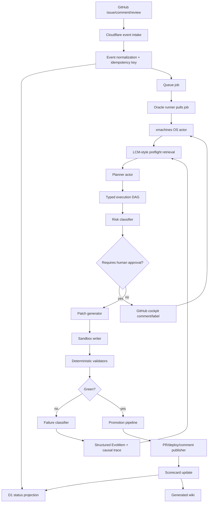

# Karpathy Recursive Vibe Engine OS Implementation Plan

> **For agentic workers:** REQUIRED SUB-SKILL: Use superpowers:subagent-driven-development (recommended) or superpowers:executing-plans to implement this plan task-by-task. Steps use checkbox (`- [ ]`) syntax for tracking.

**Goal:** Turn `vibe-engine-os` from a single autonomous script into a production-grade, low-maintenance, no-code-friendly recursive software delivery runtime.

**Architecture:** xmachines/XState owns authority, LLMs propose bounded artifacts, deterministic validators decide promotion, Pearl-style causal measurement determines which interventions improve the system, and Cloudflare/GitHub/Oracle provide the operator and execution planes. The system should feel like the nanochat of autonomous software delivery: tiny core, complete loop, one complexity dial, ruthless metrics, repeatable scripts, and a living wiki generated from reality.

**Tech Stack:** TypeScript ESM, Vitest, XState, `@xmachines/play-*`, GitHub Actions, Cloudflare Workers/D1/Queues/Pages, Oracle Free Tier runner, append-only JSONL stores, generated Markdown docs.

---

## Summary

The production goal is not a bigger agent. It is a learning runtime around agents.

Use this mental model:

```text
No-code user = intent author
LLM = proposal generator
xmachines = execution law
validators = compiler/evals
LCM-style memory = durable context substrate
Pearl = causal measurement
Agent Lightning-style traces = optimization data
nanochat = taste profile for simplicity, one dial, loops, and scoreboards
Cloudflare/GitHub = operator interface
Oracle = execution substrate
```

The covenant is: recursive intelligence inside a constitutional cage. The system may improve prompts, retrieval policy, validator ordering, model routing, approval thresholds, generated templates, and reusable actor patterns. It may not self-modify deployment credentials, workflow permissions, protected-file policy, security validators, approval gates, or rollback logic.

## Architecture DAG



## Key Design Decisions

- **Karpathy/nanochat principle:** expose one no-code complexity dial and derive the rest. Use `vibe depth`:
  - `0`: explain only
  - `1`: plan only
  - `2`: safe generated files only
  - `3`: tests plus implementation
  - `4`: deploy preview
  - `5`: protected-file changes with explicit approval
- **Ilya principle:** do not rely on scaling, huge prompts, or retries as the main improvement path. Make every run a research event and improve generalization from small, high-quality local traces.
- **Pearl principle:** every architecture change is an intervention with measurable causal effect. Track whether each intervention improves first-pass success, retry count, rollback rate, cost, and time-to-green.
- **LCM principle:** memory is not vibes. Store raw events immutably, summarize into a DAG, and preserve lossless pointers back to original tool outputs, prompts, plans, patches, and validator results.
- **Agent Lightning principle:** trace prompts, tool calls, rewards, validators, and resources as spans so prompt templates, model routing, and policies can be optimized later.
- **Helios principle:** support long-running loops, remote execution, sleep/wake triggers, metric tracking, experiment comparison, and resumable sessions.
- **HyperAgents principle:** use meta-agent self-improvement only offline. Candidate prompt/policy changes must win deterministic benchmarks before promotion.

## Implementation Plan

### Task 1: Split The Monolith Into Stable Runtime Boundaries

**Files:**
- Modify: `agent.ts`
- Create: `src/os/events.ts`
- Create: `src/os/context.ts`
- Create: `src/os/run.ts`
- Create: `src/llm/router.ts`
- Create: `src/publishing/github.ts`
- Test: `src/os/run.test.ts`

- [ ] **Step 1: Create event and context types**

```ts
export type RiskLevel = "low" | "medium" | "high";

export type OSEvent =
  | { type: "os.received"; source: "github" | "cloudflare"; payload: unknown }
  | { type: "os.preflight.completed"; findings: PreflightFinding[] }
  | { type: "plan.created"; dag: ExecutionDag }
  | { type: "approval.required"; reason: string; risk: RiskLevel }
  | { type: "approval.granted"; actor: string }
  | { type: "patch.generated"; files: GeneratedFile[] }
  | { type: "verification.passed"; results: VerificationResult[] }
  | { type: "verification.failed"; failure: ClassifiedFailure }
  | { type: "publish.completed"; prUrl?: string; previewUrl?: string }
  | { type: "learning.recorded"; lessonIds: string[] };

export type PreflightFinding = {
  kind: "memory" | "repo" | "dependency" | "policy";
  summary: string;
  confidence: number;
};

export type GeneratedFile = {
  path: string;
  content: string;
};

export type VerificationResult = {
  name: string;
  passed: boolean;
  output: string;
};

export type FailureClass =
  | "compile"
  | "test"
  | "dependency"
  | "api_drift"
  | "permission"
  | "cloud_deploy"
  | "model_output"
  | "invariant"
  | "operator_intent";

export type ClassifiedFailure = {
  failureClass: FailureClass;
  symptom: string;
  output: string;
};

export type OSContext = {
  issueNumber: string;
  issueTitle: string;
  issueBody: string;
  attempts: number;
  maxAttempts: number;
  vibeDepth: 0 | 1 | 2 | 3 | 4 | 5;
  findings: PreflightFinding[];
  dag?: ExecutionDag;
  generatedFiles: GeneratedFile[];
  verificationResults: VerificationResult[];
  failures: ClassifiedFailure[];
};

export type DagNodeKind =
  | "research"
  | "edit"
  | "test"
  | "verify"
  | "publish"
  | "learn";

export type ExecutionDagNode = {
  id: string;
  title: string;
  kind: DagNodeKind;
  dependsOn: string[];
  risk: RiskLevel;
  files: string[];
  acceptance: string[];
};

export type ExecutionDag = {
  issueNumber: string;
  title: string;
  nodes: ExecutionDagNode[];
};
```

- [ ] **Step 2: Move provider calls into `src/llm/router.ts`**

```ts
export async function callOpenAIFormat(
  baseUrl: string,
  apiKey: string,
  model: string,
  system: string,
  user: string,
  jsonMode = false,
) {
  const payload: Record<string, unknown> = {
    model,
    messages: [
      { role: "system", content: system },
      { role: "user", content: user },
    ],
  };

  if (jsonMode) payload.response_format = { type: "json_object" };

  const res = await fetch(`${baseUrl}/chat/completions`, {
    method: "POST",
    headers: {
      Authorization: `Bearer ${apiKey}`,
      "Content-Type": "application/json",
    },
    body: JSON.stringify(payload),
  });

  if (!res.ok) {
    throw new Error(`API Error from ${baseUrl}: ${res.statusText}`);
  }

  const data = (await res.json()) as {
    choices: Array<{ message: { content: string } }>;
  };

  return data.choices[0]?.message.content ?? "";
}

export async function callGemini(
  apiKey: string,
  system: string,
  user: string,
) {
  const url = `https://generativelanguage.googleapis.com/v1beta/models/gemini-1.5-flash:generateContent?key=${apiKey}`;
  const payload = {
    system_instruction: { parts: { text: system } },
    contents: [{ parts: [{ text: user }] }],
  };

  const res = await fetch(url, {
    method: "POST",
    headers: { "Content-Type": "application/json" },
    body: JSON.stringify(payload),
  });

  if (!res.ok) {
    throw new Error(`Gemini API Error: ${res.statusText}`);
  }

  const data = (await res.json()) as {
    candidates?: Array<{ content: { parts: Array<{ text: string }> } }>;
  };

  return data.candidates?.[0]?.content.parts[0]?.text ?? "";
}
```

- [ ] **Step 3: Keep `agent.ts` as thin entrypoint**

```ts
import { runOS } from "./src/os/run.js";

process.on("uncaughtException", (error: Error) => {
  console.error("Fatal uncaught exception:", error.message);
  if (error.stack) console.error(error.stack);
  process.exit(1);
});

runOS().catch((error: unknown) => {
  const message = error instanceof Error ? error.message : String(error);
  console.error("Fatal OS run failure:", message);
  process.exit(1);
});
```

- [ ] **Step 4: Add baseline run test**

```ts
import { describe, expect, it } from "vitest";

describe("OS runtime boundary", () => {
  it("keeps agent.ts thin by exporting runOS from src/os/run.js", async () => {
    const runtime = await import("./run.js");
    expect(typeof runtime.runOS).toBe("function");
  });
});
```

- [ ] **Step 5: Verify**

Run:

```bash
npm test
npx tsc --noEmit
```

Expected: all tests pass and TypeScript exits with code 0.

### Task 2: Add xmachines/XState Authority

**Files:**
- Modify: `package.json`
- Create: `src/os/machine.ts`
- Test: `src/os/machine.test.ts`

- [ ] **Step 1: Add dependency**

Add `@xmachines/play-xstate` to dependencies.

```json
"@xmachines/play-xstate": "latest"
```

- [ ] **Step 2: Define the OS machine**

```ts
import { assign, setup } from "xstate";
import type { OSContext, OSEvent } from "./events.js";

export const createInitialOSContext = (): OSContext => ({
  issueNumber: process.env.ISSUE_NUMBER || "000",
  issueTitle: process.env.ISSUE_TITLE || "Vibe Request",
  issueBody: process.env.ISSUE_BODY || "No details provided.",
  attempts: 0,
  maxAttempts: 3,
  vibeDepth: 1,
  findings: [],
  generatedFiles: [],
  verificationResults: [],
  failures: [],
});

export const osMachine = setup({
  types: {
    context: {} as OSContext,
    events: {} as OSEvent,
  },
}).createMachine({
  id: "vibe-engine-os",
  initial: "received",
  context: createInitialOSContext(),
  states: {
    received: { on: { "os.preflight.completed": "preflight" } },
    preflight: {
      on: {
        "plan.created": {
          target: "planning",
          actions: assign({ dag: ({ event }) => event.dag }),
        },
      },
    },
    planning: {
      on: {
        "approval.required": "awaiting_approval",
        "patch.generated": {
          target: "generating_patch",
          actions: assign({ generatedFiles: ({ event }) => event.files }),
        },
      },
    },
    awaiting_approval: {
      on: {
        "approval.granted": "generating_patch",
      },
    },
    generating_patch: {
      on: {
        "verification.passed": {
          target: "publishing",
          actions: assign({
            verificationResults: ({ event }) => event.results,
          }),
        },
        "verification.failed": {
          target: "learning",
          actions: assign({
            failures: ({ context, event }) => [
              ...context.failures,
              event.failure,
            ],
          }),
        },
      },
    },
    learning: {
      on: {
        "learning.recorded": "preflight",
      },
    },
    publishing: {
      on: {
        "publish.completed": "completed",
      },
    },
    failed: { type: "final" },
    completed: { type: "final" },
  },
});
```

- [ ] **Step 3: Add transition tests**

```ts
import { createActor } from "xstate";
import { describe, expect, it } from "vitest";
import { osMachine } from "./machine.js";

describe("vibe-engine-os machine", () => {
  it("pauses for human approval when a high-risk plan requires it", () => {
    const actor = createActor(osMachine).start();

    actor.send({
      type: "os.preflight.completed",
      findings: [],
    });

    actor.send({
      type: "plan.created",
      dag: {
        issueNumber: "1",
        title: "Workflow edit",
        nodes: [
          {
            id: "edit-workflow",
            title: "Edit workflow",
            kind: "edit",
            dependsOn: [],
            risk: "high",
            files: [".github/workflows/forever.yml"],
            acceptance: ["workflow parses"],
          },
        ],
      },
    });

    actor.send({
      type: "approval.required",
      reason: "Protected workflow edit",
      risk: "high",
    });

    expect(actor.getSnapshot().value).toBe("awaiting_approval");
  });

  it("records failed verification and moves to learning", () => {
    const actor = createActor(osMachine).start();

    actor.send({ type: "os.preflight.completed", findings: [] });
    actor.send({
      type: "plan.created",
      dag: { issueNumber: "1", title: "Test", nodes: [] },
    });
    actor.send({ type: "patch.generated", files: [] });
    actor.send({
      type: "verification.failed",
      failure: {
        failureClass: "compile",
        symptom: "Missing .js import extension",
        output: "TS2835",
      },
    });

    expect(actor.getSnapshot().value).toBe("learning");
    expect(actor.getSnapshot().context.failures).toHaveLength(1);
  });
});
```

- [ ] **Step 4: Verify**

Run:

```bash
npm test
npx tsc --noEmit
```

Expected: all tests pass and TypeScript exits with code 0.

### Task 3: Add DAG-First Planning

**Files:**
- Create: `src/planning/dag.ts`
- Test: `src/planning/dag.test.ts`

- [ ] **Step 1: Implement DAG validators**

```ts
import type { ExecutionDag, ExecutionDagNode } from "../os/events.js";

export function validateDag(dag: ExecutionDag): string[] {
  const errors: string[] = [];
  const ids = new Set(dag.nodes.map((node) => node.id));

  for (const node of dag.nodes) {
    for (const dependency of node.dependsOn) {
      if (!ids.has(dependency)) {
        errors.push(`Node ${node.id} depends on missing node ${dependency}`);
      }
    }
  }

  if (hasCycle(dag.nodes)) {
    errors.push("DAG contains a dependency cycle");
  }

  return errors;
}

export function topologicalSort(nodes: ExecutionDagNode[]) {
  const remaining = new Map(nodes.map((node) => [node.id, node]));
  const completed = new Set<string>();
  const sorted: ExecutionDagNode[] = [];

  while (remaining.size > 0) {
    const ready = [...remaining.values()].filter((node) =>
      node.dependsOn.every((dependency) => completed.has(dependency)),
    );

    if (ready.length === 0) {
      throw new Error("Cannot sort cyclic DAG");
    }

    for (const node of ready) {
      sorted.push(node);
      completed.add(node.id);
      remaining.delete(node.id);
    }
  }

  return sorted;
}

export function riskForFiles(files: string[]) {
  if (files.some((file) => file.startsWith(".github/"))) return "high";
  if (files.some((file) => file === "package.json" || file.endsWith(".lock"))) {
    return "medium";
  }
  return "low";
}

function hasCycle(nodes: ExecutionDagNode[]) {
  try {
    topologicalSort(nodes);
    return false;
  } catch {
    return true;
  }
}
```

- [ ] **Step 2: Test DAG behavior**

```ts
import { describe, expect, it } from "vitest";
import { riskForFiles, topologicalSort, validateDag } from "./dag.js";

describe("execution DAG", () => {
  it("rejects missing dependencies", () => {
    const errors = validateDag({
      issueNumber: "1",
      title: "Bad DAG",
      nodes: [
        {
          id: "test",
          title: "Run tests",
          kind: "test",
          dependsOn: ["missing"],
          risk: "low",
          files: [],
          acceptance: ["tests pass"],
        },
      ],
    });

    expect(errors).toContain("Node test depends on missing node missing");
  });

  it("sorts nodes topologically", () => {
    const sorted = topologicalSort([
      {
        id: "test",
        title: "Run tests",
        kind: "test",
        dependsOn: ["edit"],
        risk: "low",
        files: [],
        acceptance: ["tests pass"],
      },
      {
        id: "edit",
        title: "Edit code",
        kind: "edit",
        dependsOn: [],
        risk: "low",
        files: ["src/index.ts"],
        acceptance: ["file changed"],
      },
    ]);

    expect(sorted.map((node) => node.id)).toEqual(["edit", "test"]);
  });

  it("marks workflow edits high risk", () => {
    expect(riskForFiles([".github/workflows/forever.yml"])).toBe("high");
  });
});
```

- [ ] **Step 3: Verify**

Run:

```bash
npm test
npx tsc --noEmit
```

Expected: all tests pass and TypeScript exits with code 0.

### Task 4: Add LCM-Style Memory And Structured EvoMem

**Files:**
- Create: `src/memory/evomem.ts`
- Create: `src/memory/lcm-store.ts`
- Create: `src/memory/retrieval.ts`
- Test: `src/memory/evomem.test.ts`
- Generated runtime dirs: `.memory/raw/`, `.memory/summaries/`, `.memory/dag/`, `.evomem/events/`, `.evomem/lessons/`, `.evomem/scorecards/`

- [ ] **Step 1: Define structured lesson type and writer**

```ts
import * as fs from "fs";
import * as path from "path";
import type { FailureClass } from "../os/events.js";

export type EvoLesson = {
  id: string;
  failureClass: FailureClass;
  symptom: string;
  rootCause: string;
  fix: string;
  detector: string;
  confidence: number;
  reuseWhen: string[];
  createdAt: string;
};

export function appendLesson(rootDir: string, lesson: EvoLesson) {
  const lessonsDir = path.join(rootDir, ".evomem", "lessons");
  const eventsDir = path.join(rootDir, ".evomem", "events");
  fs.mkdirSync(lessonsDir, { recursive: true });
  fs.mkdirSync(eventsDir, { recursive: true });

  fs.writeFileSync(
    path.join(lessonsDir, `${lesson.id}.json`),
    `${JSON.stringify(lesson, null, 2)}\n`,
  );

  fs.appendFileSync(
    path.join(eventsDir, `${lesson.createdAt.slice(0, 10)}.jsonl`),
    `${JSON.stringify({ type: "lesson.recorded", lesson })}\n`,
  );
}

export function renderEvoMemMarkdown(lessons: EvoLesson[]) {
  const lines = ["# EvoMem", ""];

  for (const lesson of lessons) {
    lines.push(`- **${lesson.failureClass}**: ${lesson.symptom}`);
    lines.push(`  - Fix: ${lesson.fix}`);
    lines.push(`  - Detector: ${lesson.detector}`);
    lines.push(`  - Confidence: ${lesson.confidence}`);
  }

  return `${lines.join("\n")}\n`;
}
```

- [ ] **Step 2: Add LCM raw event append-only store**

```ts
import * as fs from "fs";
import * as path from "path";

export type RawMemoryEvent = {
  id: string;
  runId: string;
  kind: "prompt" | "tool" | "validator" | "operator" | "patch" | "publish";
  content: unknown;
  createdAt: string;
};

export function appendRawMemory(rootDir: string, event: RawMemoryEvent) {
  const rawDir = path.join(rootDir, ".memory", "raw");
  fs.mkdirSync(rawDir, { recursive: true });
  fs.appendFileSync(
    path.join(rawDir, `${event.createdAt.slice(0, 10)}.jsonl`),
    `${JSON.stringify(event)}\n`,
  );
}

export type SummaryNode = {
  id: string;
  sourceIds: string[];
  summary: string;
  createdAt: string;
};

export function writeSummaryNode(rootDir: string, node: SummaryNode) {
  const summaryDir = path.join(rootDir, ".memory", "summaries");
  fs.mkdirSync(summaryDir, { recursive: true });
  fs.writeFileSync(
    path.join(summaryDir, `${node.id}.json`),
    `${JSON.stringify(node, null, 2)}\n`,
  );
}
```

- [ ] **Step 3: Test structured memory**

```ts
import * as fs from "fs";
import * as os from "os";
import * as path from "path";
import { describe, expect, it } from "vitest";
import { appendLesson, renderEvoMemMarkdown } from "./evomem.js";

describe("structured EvoMem", () => {
  it("writes lessons as json and jsonl events", () => {
    const root = fs.mkdtempSync(path.join(os.tmpdir(), "evomem-"));

    appendLesson(root, {
      id: "lesson_001",
      failureClass: "compile",
      symptom: "Missing .js import extension",
      rootCause: "NodeNext ESM local import used .ts path",
      fix: "Use .js extension in TypeScript local imports",
      detector: "esm_import_extension_validator",
      confidence: 0.95,
      reuseWhen: ["module=NodeNext"],
      createdAt: "2026-07-04T00:00:00.000Z",
    });

    expect(
      fs.existsSync(path.join(root, ".evomem", "lessons", "lesson_001.json")),
    ).toBe(true);
    expect(
      fs.readFileSync(
        path.join(root, ".evomem", "events", "2026-07-04.jsonl"),
        "utf8",
      ),
    ).toContain("lesson.recorded");
  });

  it("renders human-readable markdown from lessons", () => {
    const markdown = renderEvoMemMarkdown([
      {
        id: "lesson_001",
        failureClass: "compile",
        symptom: "Missing .js import extension",
        rootCause: "NodeNext ESM",
        fix: "Use .js extension",
        detector: "esm_import_extension_validator",
        confidence: 0.95,
        reuseWhen: ["module=NodeNext"],
        createdAt: "2026-07-04T00:00:00.000Z",
      },
    ]);

    expect(markdown).toContain("Missing .js import extension");
  });
});
```

- [ ] **Step 4: Verify**

Run:

```bash
npm test
npx tsc --noEmit
```

Expected: all tests pass and TypeScript exits with code 0.

### Task 5: Add Deterministic Validators And Protected File Policy

**Files:**
- Create: `src/verification/validators.ts`
- Test: `src/verification/validators.test.ts`

- [ ] **Step 1: Implement validators**

```ts
import type { GeneratedFile } from "../os/events.js";

export type ValidatorResult = {
  name: string;
  passed: boolean;
  output: string;
};

const protectedFiles = [
  ".github/",
  ".env",
  "package.json",
  "package-lock.json",
  "bun.lockb",
];

export function validateGeneratedFiles(files: GeneratedFile[]): ValidatorResult[] {
  return [
    validateFileAllowlist(files),
    validateNoProtectedFiles(files),
    validateEsmImportExtensions(files),
  ];
}

export function validateFileAllowlist(files: GeneratedFile[]): ValidatorResult {
  const invalid = files.filter(
    (file) =>
      !file.path.startsWith("src/") &&
      !file.path.startsWith("tests/") &&
      !file.path.startsWith(".planning/") &&
      !file.path.startsWith(".skills/"),
  );

  return {
    name: "file_allowlist",
    passed: invalid.length === 0,
    output:
      invalid.length === 0
        ? "All files are inside allowed paths"
        : `Disallowed paths: ${invalid.map((file) => file.path).join(", ")}`,
  };
}

export function validateNoProtectedFiles(files: GeneratedFile[]): ValidatorResult {
  const invalid = files.filter((file) =>
    protectedFiles.some((protectedPath) => file.path.startsWith(protectedPath)),
  );

  return {
    name: "protected_files",
    passed: invalid.length === 0,
    output:
      invalid.length === 0
        ? "No protected files changed"
        : `Protected paths require approval: ${invalid
            .map((file) => file.path)
            .join(", ")}`,
  };
}

export function validateEsmImportExtensions(
  files: GeneratedFile[],
): ValidatorResult {
  const offenders = files.filter(
    (file) =>
      file.path.endsWith(".ts") &&
      /from\s+["']\.{1,2}\/[^"']*(?<!\.js)["']/.test(file.content),
  );

  return {
    name: "esm_import_extensions",
    passed: offenders.length === 0,
    output:
      offenders.length === 0
        ? "Local ESM imports use .js extensions"
        : `Missing .js import extension in: ${offenders
            .map((file) => file.path)
            .join(", ")}`,
  };
}
```

- [ ] **Step 2: Test validators**

```ts
import { describe, expect, it } from "vitest";
import {
  validateEsmImportExtensions,
  validateFileAllowlist,
  validateNoProtectedFiles,
} from "./validators.js";

describe("validators", () => {
  it("rejects files outside generated-code allowlist", () => {
    const result = validateFileAllowlist([
      { path: "README.md", content: "# bad" },
    ]);

    expect(result.passed).toBe(false);
  });

  it("rejects protected files", () => {
    const result = validateNoProtectedFiles([
      { path: ".github/workflows/forever.yml", content: "name: test" },
    ]);

    expect(result.passed).toBe(false);
  });

  it("catches local ESM imports without .js extension", () => {
    const result = validateEsmImportExtensions([
      { path: "src/main.ts", content: 'import { x } from "./x";' },
    ]);

    expect(result.passed).toBe(false);
  });

  it("accepts local ESM imports with .js extension", () => {
    const result = validateEsmImportExtensions([
      { path: "src/main.ts", content: 'import { x } from "./x.js";' },
    ]);

    expect(result.passed).toBe(true);
  });
});
```

- [ ] **Step 3: Verify**

Run:

```bash
npm test
npx tsc --noEmit
```

Expected: all tests pass and TypeScript exits with code 0.

### Task 6: Add Pearl-Style Research Runtime

**Files:**
- Create: `src/research/objectives.ts`
- Create: `src/research/traces.ts`
- Create: `src/research/interventions.ts`
- Create: `src/research/scorecard.ts`
- Test: `src/research/scorecard.test.ts`

- [ ] **Step 1: Define trace span and intervention types**

```ts
export type TraceSpan = {
  runId: string;
  phase: string;
  promptTemplateId?: string;
  model?: string;
  inputContextIds: string[];
  toolCalls: string[];
  validatorResults: Array<{ name: string; passed: boolean }>;
  reward: number;
  durationMs: number;
  costEstimateUsd: number;
  outcome: "passed" | "failed" | "blocked";
  createdAt: string;
};

export type InterventionRecord = {
  id: string;
  runId: string;
  intervention: string;
  targetMetric:
    | "first_pass_success"
    | "retry_count"
    | "rollback_count"
    | "time_to_green"
    | "cost_per_green_pr";
  before?: number;
  after?: number;
  confidence?: number;
  createdAt: string;
};
```

- [ ] **Step 2: Implement scorecard reducer**

```ts
import type { TraceSpan } from "./traces.js";

export type Scorecard = {
  runs: number;
  passed: number;
  failed: number;
  blocked: number;
  firstPassSuccessRate: number;
  averageCostUsd: number;
};

export function buildScorecard(spans: TraceSpan[]): Scorecard {
  const terminal = spans.filter((span) =>
    ["passed", "failed", "blocked"].includes(span.outcome),
  );
  const passed = terminal.filter((span) => span.outcome === "passed").length;
  const failed = terminal.filter((span) => span.outcome === "failed").length;
  const blocked = terminal.filter((span) => span.outcome === "blocked").length;
  const totalCost = terminal.reduce(
    (sum, span) => sum + span.costEstimateUsd,
    0,
  );

  return {
    runs: terminal.length,
    passed,
    failed,
    blocked,
    firstPassSuccessRate: terminal.length === 0 ? 0 : passed / terminal.length,
    averageCostUsd: terminal.length === 0 ? 0 : totalCost / terminal.length,
  };
}
```

- [ ] **Step 3: Test scorecard**

```ts
import { describe, expect, it } from "vitest";
import { buildScorecard } from "./scorecard.js";
import type { TraceSpan } from "./traces.js";

describe("research scorecard", () => {
  it("computes pass rate and average cost", () => {
    const spans: TraceSpan[] = [
      {
        runId: "1",
        phase: "completed",
        inputContextIds: [],
        toolCalls: [],
        validatorResults: [],
        reward: 1,
        durationMs: 100,
        costEstimateUsd: 0.2,
        outcome: "passed",
        createdAt: "2026-07-04T00:00:00.000Z",
      },
      {
        runId: "2",
        phase: "completed",
        inputContextIds: [],
        toolCalls: [],
        validatorResults: [],
        reward: 0,
        durationMs: 100,
        costEstimateUsd: 0.4,
        outcome: "failed",
        createdAt: "2026-07-04T00:00:00.000Z",
      },
    ];

    expect(buildScorecard(spans)).toMatchObject({
      runs: 2,
      passed: 1,
      failed: 1,
      firstPassSuccessRate: 0.5,
      averageCostUsd: 0.3,
    });
  });
});
```

- [ ] **Step 4: Verify**

Run:

```bash
npm test
npx tsc --noEmit
```

Expected: all tests pass and TypeScript exits with code 0.

### Task 7: Add No-Code Operator Surface

**Files:**
- Create: `src/operator/commands.ts`
- Create: `src/operator/cockpit.ts`
- Test: `src/operator/commands.test.ts`

- [ ] **Step 1: Parse slash commands**

```ts
export type OperatorCommand =
  | { type: "plan" }
  | { type: "approve" }
  | { type: "retry" }
  | { type: "rollback" }
  | { type: "status" }
  | { type: "deploy" }
  | { type: "unknown"; raw: string };

export function parseOperatorCommand(input: string): OperatorCommand {
  const command = input.trim().split(/\s+/)[0]?.toLowerCase();

  switch (command) {
    case "/plan":
      return { type: "plan" };
    case "/approve":
      return { type: "approve" };
    case "/retry":
      return { type: "retry" };
    case "/rollback":
      return { type: "rollback" };
    case "/status":
      return { type: "status" };
    case "/deploy":
      return { type: "deploy" };
    default:
      return { type: "unknown", raw: input };
  }
}
```

- [ ] **Step 2: Generate cockpit comment**

```ts
import type { OSContext } from "../os/events.js";

export function renderCockpitComment(state: string, context: OSContext) {
  const changedFiles = context.generatedFiles.map((file) => `- ${file.path}`);
  const failures = context.failures.map(
    (failure) => `- ${failure.failureClass}: ${failure.symptom}`,
  );

  return [
    "## Vibe Engine OS Cockpit",
    "",
    `**State:** ${state}`,
    `**Issue:** #${context.issueNumber} ${context.issueTitle}`,
    `**Vibe Depth:** ${context.vibeDepth}`,
    `**Attempts:** ${context.attempts}/${context.maxAttempts}`,
    "",
    "### Changed Files",
    changedFiles.length > 0 ? changedFiles.join("\n") : "No files generated yet.",
    "",
    "### Latest Failures",
    failures.length > 0 ? failures.join("\n") : "No failures recorded.",
    "",
    "### Commands",
    "`/plan` `/approve` `/retry` `/rollback` `/status` `/deploy`",
    "",
  ].join("\n");
}
```

- [ ] **Step 3: Test commands**

```ts
import { describe, expect, it } from "vitest";
import { parseOperatorCommand } from "./commands.js";

describe("operator commands", () => {
  it("parses known commands", () => {
    expect(parseOperatorCommand("/approve")).toEqual({ type: "approve" });
    expect(parseOperatorCommand("/deploy please")).toEqual({ type: "deploy" });
  });

  it("marks unknown commands as non-mutating unknowns", () => {
    expect(parseOperatorCommand("/shipit")).toEqual({
      type: "unknown",
      raw: "/shipit",
    });
  });
});
```

- [ ] **Step 4: Verify**

Run:

```bash
npm test
npx tsc --noEmit
```

Expected: all tests pass and TypeScript exits with code 0.

### Task 8: Add nanochat-Style Runs, Scoreboard, And Generated Wiki

**Files:**
- Create: `runs/smoke.sh`
- Create: `runs/local-issue.sh`
- Create: `runs/replay-run.sh`
- Create: `src/wiki/generate.ts`
- Create: `docs/wiki/overview.md`
- Create: `docs/wiki/operator-guide.md`
- Create: `docs/wiki/architecture-dag.md`
- Create: `docs/wiki/scorecard.md`
- Modify: `package.json`
- Test: `src/wiki/generate.test.ts`

- [ ] **Step 1: Add scripts**

Add package scripts:

```json
"check": "tsc --noEmit && vitest run",
"wiki": "tsx src/wiki/generate.ts",
"smoke": "bash runs/smoke.sh"
```

- [ ] **Step 2: Add smoke script**

```bash
#!/usr/bin/env bash
set -euo pipefail

npm test
npx tsc --noEmit
```

- [ ] **Step 3: Add local issue script**

```bash
#!/usr/bin/env bash
set -euo pipefail

export ISSUE_NUMBER="${ISSUE_NUMBER:-000}"
export ISSUE_TITLE="${ISSUE_TITLE:-Local Smoke Issue}"
export ISSUE_BODY="${ISSUE_BODY:-Run local Vibe Engine smoke path.}"

bun run agent.ts
```

- [ ] **Step 4: Add generated wiki overview**

`src/wiki/generate.ts` should write Markdown pages from static architecture metadata first, then later include scorecards and memory summaries.

```ts
import * as fs from "fs";
import * as path from "path";

const wikiDir = path.join(process.cwd(), "docs", "wiki");

fs.mkdirSync(wikiDir, { recursive: true });

fs.writeFileSync(
  path.join(wikiDir, "overview.md"),
  [
    "# Vibe Engine OS Wiki",
    "",
    "Vibe Engine OS is a no-code-friendly autonomous software delivery runtime.",
    "",
    "The core loop is: intent -> DAG plan -> bounded patch -> verification -> PR/deploy -> learning.",
    "",
  ].join("\n"),
);

fs.writeFileSync(
  path.join(wikiDir, "operator-guide.md"),
  [
    "# Operator Guide",
    "",
    "Use GitHub labels and slash commands to control the system.",
    "",
    "- `/plan`: generate a plan without mutation",
    "- `/approve`: approve a paused high-risk change",
    "- `/retry`: retry after a recoverable failure",
    "- `/rollback`: request rollback instructions",
    "- `/status`: refresh status",
    "- `/deploy`: request preview deploy",
    "",
  ].join("\n"),
);
```

- [ ] **Step 5: Verify**

Run:

```bash
npm run check
npm run wiki
test -f docs/wiki/overview.md
test -f docs/wiki/operator-guide.md
```

Expected: tests and TypeScript pass, and wiki files exist.

### Task 9: Add Cloudflare And Oracle Adapters Behind Interfaces

**Files:**
- Create: `src/cloudflare/intake.ts`
- Create: `src/cloudflare/status.ts`
- Create: `src/oracle/runner.ts`
- Test: `src/cloudflare/intake.test.ts`
- Test: `src/oracle/runner.test.ts`

- [ ] **Step 1: Define Cloudflare intake contract**

```ts
export type IntakeEvent = {
  source: "github";
  eventName: string;
  deliveryId: string;
  body: unknown;
};

export type NormalizedJob = {
  idempotencyKey: string;
  source: "github";
  issueNumber: string;
  title: string;
  body: string;
};

export function normalizeIntakeEvent(event: IntakeEvent): NormalizedJob {
  const body = event.body as {
    issue?: { number?: number; title?: string; body?: string };
    comment?: { body?: string };
    review?: { body?: string };
    pull_request?: { number?: number; title?: string };
  };

  const issueNumber =
    body.issue?.number?.toString() ??
    body.pull_request?.number?.toString() ??
    "000";

  return {
    idempotencyKey: `${event.eventName}:${event.deliveryId}`,
    source: "github",
    issueNumber,
    title: body.issue?.title ?? body.pull_request?.title ?? "Vibe Request",
    body: body.comment?.body ?? body.review?.body ?? body.issue?.body ?? "",
  };
}
```

- [ ] **Step 2: Define Oracle runner contract**

```ts
export type RunnerJob = {
  id: string;
  issueNumber: string;
  title: string;
  body: string;
};

export type RunnerResult = {
  jobId: string;
  status: "completed" | "failed" | "blocked";
  summary: string;
};

export async function runOracleJob(job: RunnerJob): Promise<RunnerResult> {
  return {
    jobId: job.id,
    status: "blocked",
    summary:
      "Oracle runner adapter is defined but not connected to a live runner yet.",
  };
}
```

- [ ] **Step 3: Verify**

Run:

```bash
npm test
npx tsc --noEmit
```

Expected: all tests pass and TypeScript exits with code 0.

## Production Acceptance Criteria

- `agent.ts` is a thin entrypoint and all runtime logic lives under `src/`.
- xmachines/XState owns lifecycle transitions.
- Every plan is represented as a validated DAG before mutation.
- Every generated file passes deterministic validators before writing or promotion.
- Protected paths require explicit approval.
- Structured memory uses append-only JSONL plus generated Markdown summaries.
- Research traces and scorecards record improvement over time.
- No-code users can operate with labels, slash commands, and cockpit comments.
- The generated wiki reflects actual runtime state and operator commands.
- Cloudflare and Oracle integration exists behind testable adapters before live credentials are required.
- `npm run check` passes.

## Rollout Order

1. Split the monolith and add the xmachines/XState lifecycle.
2. Add DAG planning, validators, and protected-file approval policy.
3. Add structured EvoMem and LCM-style raw memory.
4. Add Pearl-style traces, interventions, and scorecards.
5. Add no-code cockpit comments and slash command parsing.
6. Add nanochat-style scripts, generated wiki, and scoreboard.
7. Add Cloudflare intake/status adapters.
8. Add Oracle runner adapter.
9. Move heavy execution from GitHub Actions to Oracle while preserving Actions fallback.
10. Add offline HyperAgents-style prompt/policy tournament only after deterministic benchmarks exist.

## Sources To Keep In The Design Covenant

- Karpathy/nanochat: one complexity dial, complete pipeline, small fast eval loops, leaderboard, repeatable scripts.
- Karpathy/Software 2.0 and vibe coding: English as interface, but production requires verification and system design.
- Ilya Sutskever: scaling alone is not enough; future gains require research and better generalization from limited data.
- Pearl: causal interventions, not ritual accumulation.
- Volt/LCM: immutable memory store, summary DAG, lossless retrieval, deterministic compaction.
- Agent Lightning: traces/spans as the substrate for optimization.
- Helios: overnight loops, remote execution, metrics, sleep/wake, experiment comparison.
- HyperAgents: meta-improvement as offline research, not direct production self-modification.
